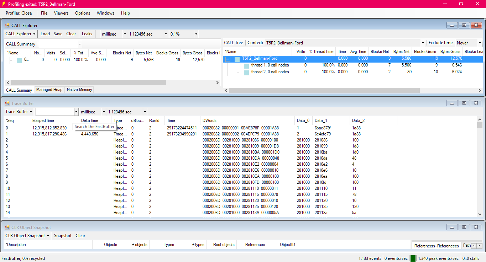
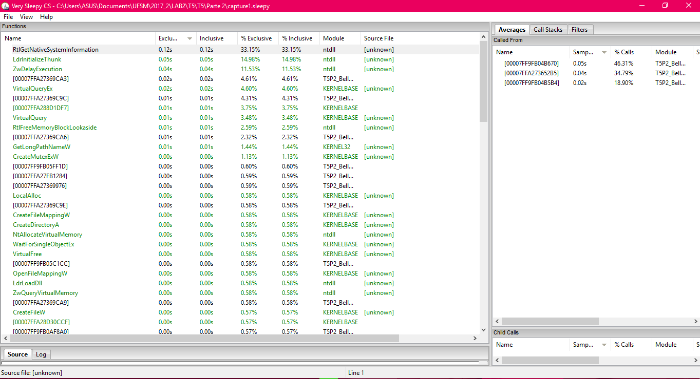

[Programação Paralela](https://github.com/AndreaInfUFSM/elc139-2018a) > Trabalhos

# T2: Experiências com Profilers

Disciplina: ELC139 - Programação Paralela  
Professora: Andrea Schwertner Charão  
Aluna: Marinara Rübenich Fumagalli
## Sumário
1. [**Parte 1**](#1-parte-1)   
    a. [Perfil de Execução - Alteração](#a-perfil-de-execução---alteração)  
    b. [Perfil de Execução - Paralelização](#b-perfil-de-execução---paralelização)
2. [**Parte 2**](#1-parte-1)  
    a. [Profilers - Particularidades](#a-profilers---particularidades)  
    b. [Profilers - Dúvidas e Dificuldades](#b-profilers---dúvidas-e-dificuldades)  
    c. [Profilers - Resultados](#c-profilers---resultados)  
3. [**Anexos**](#3-anexos)  
    a. [Parte 1](#a-parte-1)  
    b. [Parte 2](#b-parte-2)  
4. [**Referências**](#4-referências)  
## 1. Parte 1
### a. Perfil de Execução - Alteração
 #### O perfil é afetado pelas opções de configuração?
 Sim. Qualquer modificação no tamanho do vetor ou no número de repetições afeta o resultado da análise, em geral diferenças mais nítidas ocorrem quando se modifica o número de repetições do código.
### b. Perfil de Execução - Paralelização
#### Pelo perfil de execução, há alguma função que poderia ser candidata a paralelização? Por quê?
Sim, esta função é a 'dot_product', pois pude notar, através das minhas tentativas, que quanto maior o número de repetições, mais discrepâncias ocorrem no tempo de processamento, em um dado momento ela chegou a tomar 100% do tempo [[Vide Screenshot](Parte_1/Screenshots/2.5.1.Gprof-Flat_Profile(config.50000_200).png)]. Como o tempo total de execução do programa em si não é influenciado por entradas (que são dadas apenas no início) mas sim pelo processador, paralelizar esta função nos daria um ganho extremamente considerável no desempenho.
## 2. Parte 2
### a. Profilers - Particularidades
#### Particularidades de instalação, recursos ou funcionamento dos profilers
Testei/"apanhei" diversos profilers tanto no Windows quanto no Linux, dentre eles:  
\- AQtime;  
\- CallGrind;  
\- C++ Performance Validator;  
\- Dynatrace;  
\- OProfile;  
\- VTune™ Amplifier;  
Até escolher o GlowCode e o VerySleepy CS, ambos rodam em SO Windows, o motivo da minha escolha foi a leveza dos programas, a facilidade de instalação e a rapidez da análise. Além de tudo traz informações importantes e necessárias sobre o programa, basicamente ambos procuram quais funções podem estar afetando o desempenho do sistema, mostram tempos de execução das funções, bem como tempo total de execução do programa. O VerySleep é um pouco mais completo além de tudo mostra nós pais, nós filhos e todas as suas chamadas, mostra o tempo de execução da função sozinha ou dela e de todas as suas chamadas, mostra os módulos utilizados e partes do código-fonte, também é possível criar um projeto do resultado ou exportar para CSV. Todos os outros deram algum problema ou necessitavam de outros programas ou aplicações para poder iniciar a análise, além de serem pesados e com pouquíssima documentação.
### b. Profilers - Dúvidas e Dificuldades
#### Dúvidas e/ou dificuldades encontradas
De início tive bastante dificuldade nas tentativas de análise via terminal Linux, justamente por não ter uma visão geral do que ocorre, não ter botões, não ter janelas, não ter interface, é bem mais complexo e isso particularmente me faz muita falta, acabei instalando bibliotecas e softwres desnecessários e não obtive bons resultados. Já os profilers mais famosos que rodam em Windows pediam compilações anteriores, outros programas a instalar ou mostravam alguma mensagem de erro no fim da análise. Os dois que escolhi rodaram e mostraram resultados tranquilamente. Por fim, em geral a maior dificuldade é a falta de documentação e turoriais sobre instalação e primeiros passos para análise, também senti falta de exemplos, pois acredito que todos estes softwares tem muito a oferecer.
### c. Profilers - Resultados
#### Resultados obtidos
Percebi que como na Parte 1, quando se mudam as configurações do código, os resultados também mudam, para o caso do programa que escolhi [[Bellman-Ford](Parte_2/Código/T5P2_Bellman-Ford.cpp)] o que mais muda é o número de chamadas das funções.
## 3. Anexos
### a. Parte 1
Todos os Screenshots enconram-se disponíveis [**aqui**](Parte_1/Screenshots)
### b. Parte 2  
  
  
Também podem ser encontrados [**aqui**](Parte_2).
## 4. Referências
- Artigas, Pedro Vaz. Processamento Paralelo: Dois Exemplos. [Link](http://www.lsi.usp.br/~phoenix/parex/parint.html%25).
- Electric Software, Inc. Sobre e Download. [Link](http://www.glowcode.com/update.php).
- Falcão, Djalma M. Introdução ao Desenvolvimento de Aplicações Paralelas e Distribuídas. [Link](http://slideplayer.com.br/slide/1600688/).
- Mattos, Luís Felipe de Souza. Cap. 2: Programação Paralela. [Link](http://www.ic.unicamp.br/~cortes/mo601/trabalho_mo601/luis_felipe_matos_cap2/Trabalho-MC852-ra107822.pdf).
- Shakeel, Yusuf. Bellman-Ford Algorithm. [Link](https://www.dyclassroom.com/graph/bellman-ford-algorithm).
- Very Sleep. Download e Documentação. [Link](https://github.com/VerySleepy/verysleepy).
